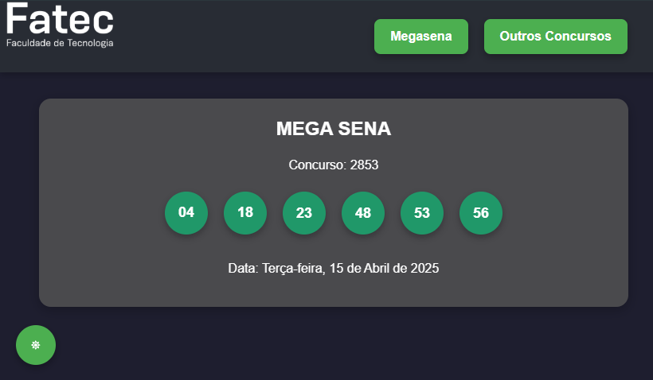

# Desenvolvimento Web II – Prof. Arley  
## Atividade 4 – HTTP Request e Styled  



### Descrição da Atividade  
Desenvolver um aplicativo utilizando React com TypeScript para exibir o resultado mais recente do sorteio da Mega-Sena. A aplicação deverá realizar uma requisição ao serviço público da Caixa Econômica Federal, disponível em:  
[https://servicebus2.caixa.gov.br/portaldeloterias/api/home/ultimos-resultados](https://servicebus2.caixa.gov.br/portaldeloterias/api/home/ultimos-resultados), e apresentar o resultado na interface da aplicação.

### Objetivos  
- Compreender e utilizar componentes React;  
- Implementar React Context para o gerenciamento de dados;  
- Utilizar o hook `useEffect` para lidar com efeitos colaterais;  
- Estilizar componentes com Styled Components, incluindo temas e estilos globais;  
- Realizar requisições HTTP a serviços externos.  

### Requisitos Funcionais  
1. A aplicação deverá consumir o serviço de loterias da Caixa e exibir o resultado mais recente do sorteio da Mega-Sena.  

### Requisitos Não Funcionais  
1. O projeto deverá seguir a seguinte organização de pastas:  
   ```
   src/
   ├── components/ → Componente Ball (exibe cada dezena)
   ├── contexts/ → Contexto de loteria
   ├── hooks/ → Hooks personalizados
   ├── pages/ → Componente Megasena (página principal)
   ├── services/ → Comunicação com a API da Caixa
   └── types/ → Tipagens da aplicação
   ```
2. A aplicação deverá rodar na porta `3010`.  
3. A aplicação deverá realizar a requisição à API da Caixa logo na inicialização. Durante a requisição, deve ser exibida a mensagem “Carregando...”.  
4. A aplicação deverá possuir temas claro e escuro, com a possibilidade de alternância entre eles por meio de um botão flutuante no canto inferior esquerdo.  
5. Cada dezena deverá ser exibida com cor de fundo `#209869` e fonte na cor `#fff`.  
6. O painel principal com as dezenas deverá estar centralizado vertical e horizontalmente na tela.  
7. Não é permitido o uso de arquivos CSS convencionais. Toda a estilização deverá ser realizada exclusivamente com Styled Components.  

### Tecnologias Utilizadas  
- **React**: Biblioteca para construção da interface.  
- **TypeScript**: Superset do JavaScript para tipagem estática.  
- **React Router**: Gerenciamento de rotas na aplicação.  
- **Styled Components**: Estilização diretamente nos componentes.  
- **Axios**: Biblioteca para realizar requisições HTTP.  
